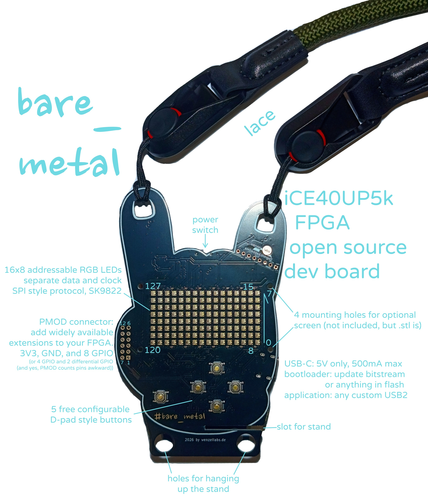
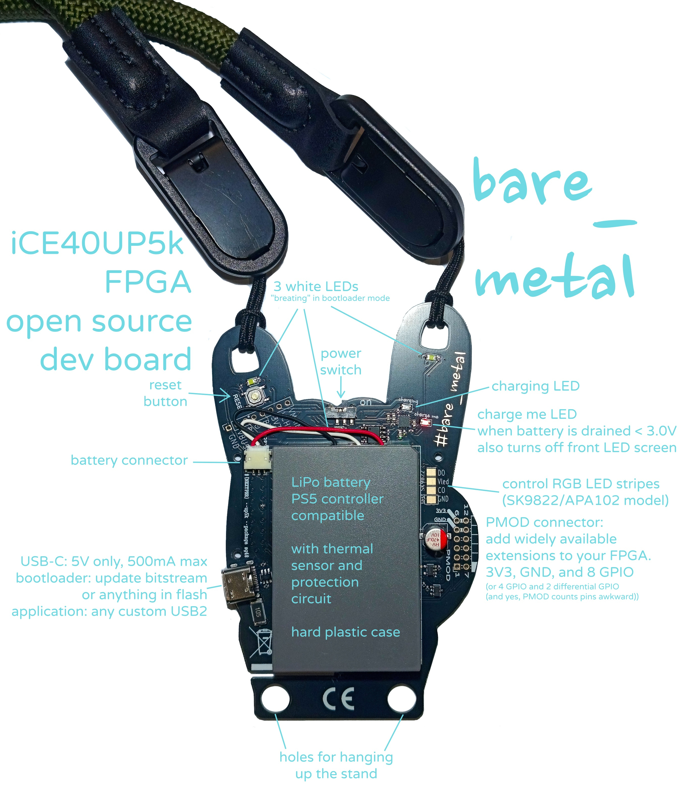
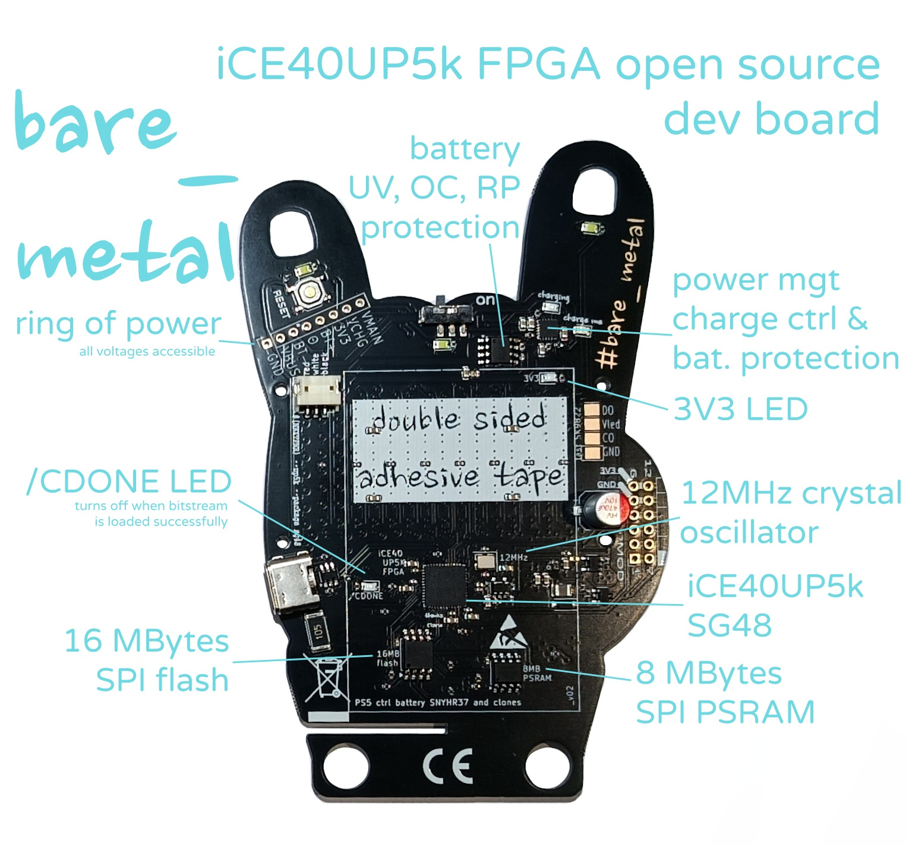
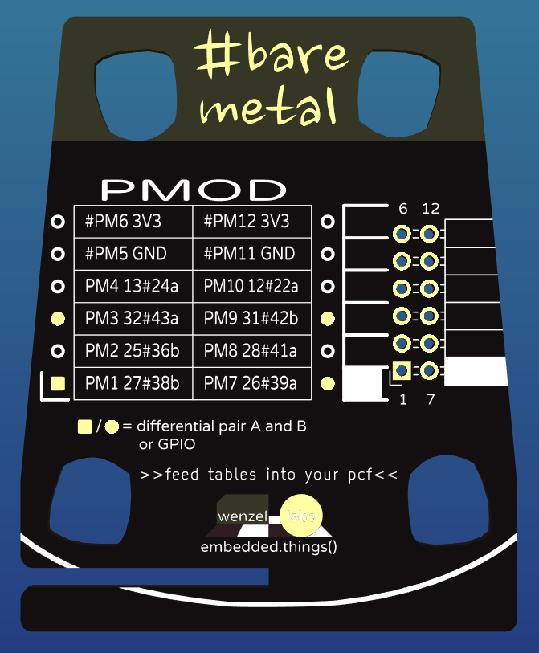
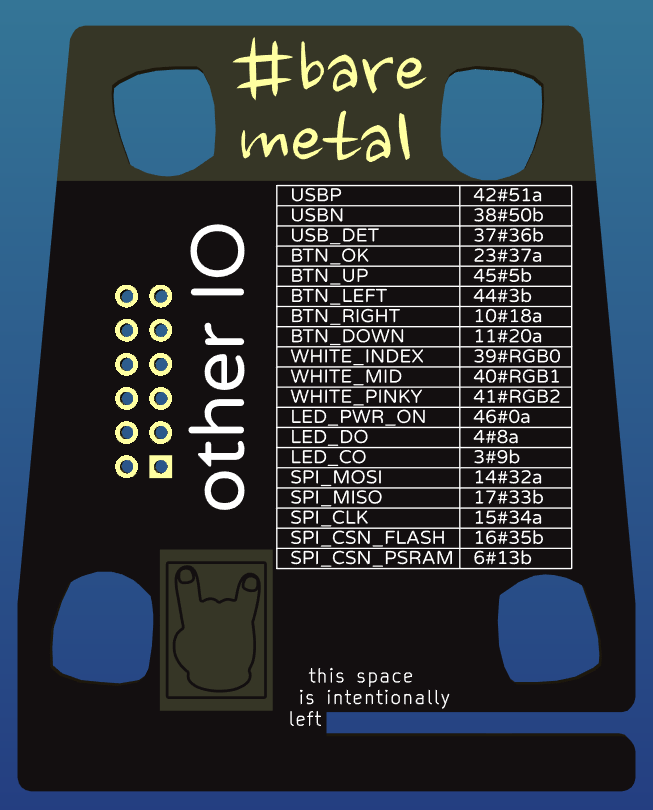
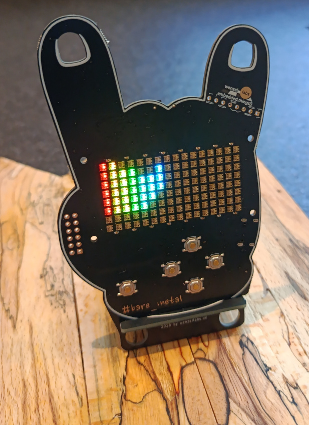
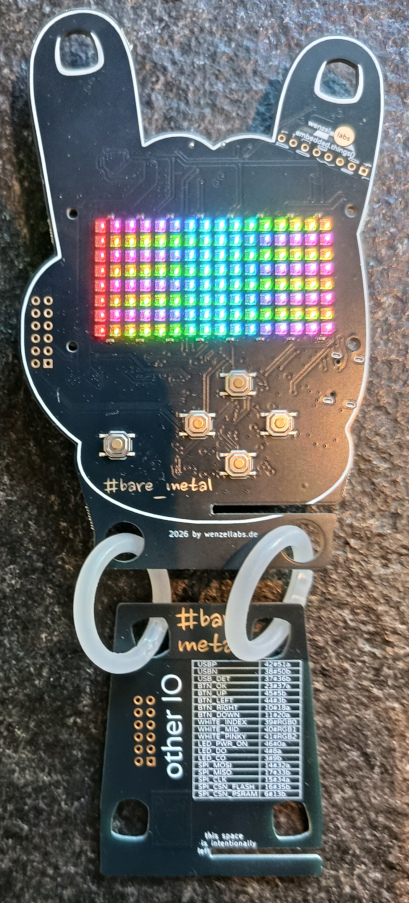
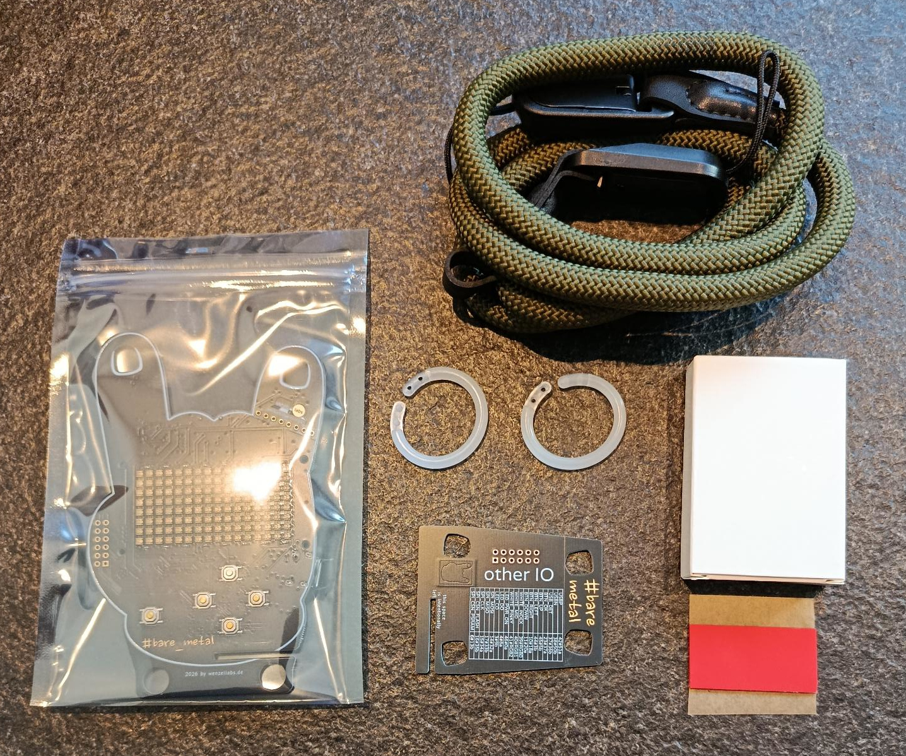

# bare_metal

**bare metal** is an FPGA development board - the ideal platform to get started with FPGAs and HDL of one or another sort. all open source.







bare_metal, the opensource FPGA development board:

- five user buttons: OK, left, right, up, down
- large 16x8 SPI-addressable RGB LEDs display
- extensible through a PMOD interface
- comes with a battery for many hours of runtime
- extensive power management, monitoring and battery protection in HW
- allows for CPU-less designs or soft-core CPUs
- get into FPGAs with the **yosys** and **nextpnr** all open source toolchains
- program in python/amarant, verilog, spade or others
- comes with a stand
- three bright white LEDs as simple debug or flashlight
- usable as name tag, comes with a lace
- comes with a bootloader as 1st of four bitstreams
- can host up to 3 user bitstreams
- 16MBytes flash in total (1 bitstream takes < 128kBytes)
- 8MBytes RAM in total
- transputer research platform, as 3 user bitstreams can "boot" each other, see `bootloader` below
- hacky but feasible: more that 3 user bitstreams (hundreds)

## tech bits

### schematic

see the [hardware](hardware/) directory. find [the schematics](hardware/bare_metal_schematic.pdf), the KiCad sources and [some](hardware/bare_metal_front.png) [nice](hardware/bare_metal_back.png) [renderings](hardware/bare_metal_3d.png).

### memory

- 16MBytes SPI flash (W25Q128JVSIQ) this is where the FPGA boots from and user storage such as text, fonts, images, sounds, video, etc.
- 8MBytes SPI PSRAM (LY68L6400) far all of your extensive memory needs

here's a memory map of the SPI flash:

```
# 0x000_0000 - 0x000_009f =160b, multiboot header, slot table
# 0x000_00a0 - 0x001_efff ~124kB, slot 0, bare_metal_bootloader
# 0x001_f000 - 0x001_ffff =4kB, bootmetadata
# 0x002_0000 - 0x003_ffff =128kB, slot 1, user bitstream, hackerstacker_demo by default
# 0x004_0000 - 0x005_ffff =128kB, slot 2, another bitstream, transputers anyone?
# 0x006_0000 - 0x007_ffff ~128kB, slot 3, yab, hooray for transputers!
# 0x008_0000 - 0x100_0000 ~15.5MB, user data, images, fonts, text, sounds, videos etc
```
```
# in hackerstacker_demo, we reserve the first 512 KB for bootloader and bitstreams,
# and use the rest for user data:
# 0x008_0000 - 0x008_ffff = 64 kB, font data
# 0x009_0000 - 0x009_ffff = 64 kB, game data
# 0x00a_0000 - 0x00a_ffff = 64 kB, nick names
# 0x00b_0000 - 0x0ff_ffff = ~15.3MB images, video
```

### bootloader

the bootloader is always started after power up or reset. it lives in slot0 of the four default bitstream slots.

the bootloader is forked from https://github.com/tinyfpga/TinyFPGA-Bootloader which looks unmaintained nowadays. we forked, and implement our bootloader and the `tinyprog` flashing tool at https://codeberg.org/wenzellabs/bare_metal_bootloader

```

                   [-----------][----------][----------]
                   [ user bit- ][ user bit-][ user bit-]
                   [ stream 1  ][ stream 2 ][ stream 3 ]
                   [           ][          ][          ]
                   [===========][==========][==========]
                   [-----------------------------------]
                   [    USB-bootloader bitstream 0     ]
                   [===================================]
               [-------------------------------------------]
               [ iCE40-up5k-sg48 FPGA, 5k LCs, DSP fn()s   ]
               [===========================================]
[-----]    [----------------------------------------------------]    [---------------]
[ USB ]----[ bare_metal, buttons, batt., LEDs, RGB-display, PMOD]----[PMOD extensions]
[=====]    [====================================================]    [===============]

```

the bootloader animates the three white LEDs `index`, `middle` and `pinky`. if the bootloader detects a host PC (if it gets USB enumerated) it stays in the bootloader and creates a cdc_acm /dev/ttyACM0 that can be used in conjunction with tinyprog to flash user bitstreams into slot1, slot2 or slot3, or any other flash content.

if no host PC is detected the bootloader "jumps" to the user bitstream in slot1.

**stay in bootloader** although there's no host PC:

- press btn_**down** while powerup/reset.

jump to **slot1** user bitstrem although we're connected to a host PC:

- press btn_**ok** while powerup/reset.

jump to **slot2** user bitstrem although we're connected to a host PC:

- press btn_**left** while powerup/reset.

jump to **slot3** user bitstrem although we're connected to a host PC:

- press btn_**right** while powerup/reset.

### examples

#### hackerstacker_demo

by default the first user bitstream in slot1 is hackerstacker_demo, that has various modes, which can be advanced by a long btn_ok press.

modes:

- hackerstacker game, control: btn_ok
- scroll user text. control: switch text: btn_ok, brightness: btn_up, btn_down, scroll-mode: btn_left, font: btn-right
- skating images. control: btn_ok
- various static patterns, rainbow, trans flag, checker board. control: btn_ok
- various animated patterns, rainbow, trans flag. control: btn_ok

the texts, fonts and images live in the SPI flash aside from the bitstream, so they can be replaced or extended without re-synthesizing the bitstream.
see [the hackerstacker_demo directory](firmware/examples/amaranth/hackerstacker_demo) and there the make targets
```
make flash-nick # see nick.txt first!
make flash-font
make flash-image # see image.txt first!
```

#### julia

reach it by pressing btn_left while powerup/reset.

by default the second user bitstream in slot2 is julia. it renders a julia set, and loops:

- pan to a random position
- zoom in until the entropy is too low
- zoom out again

the up/down/left/right control the complex coordinate C of the julia set being rendered.

the OK button changes the palette.

#### psram_probe

reach it by pressing btn_right while powerup/reset.

for now the default third user bitstream in slot3 is psram_probe, just a production PSRAM test. lights up one LED in green per pass.

I hope to get some small spade demo, looking at you @TheZoq2.

### power

#### battery

a PS5 controller compatible battery similar to SNYHR37. 2500 mAh, 1S.
the little plasic box is a nice feature to protect the pouch cell from stabbing you and vice versa.

#### USB-C

there's a current limit of 500mA in place. no USB-PD, just 5V.

the data pins are usable and available for creating any USB2 devices. the board has no dedicated USB-HW (aside from ESD protection) but anything can be implemented in the FPGA, just as the bootloader does. related pins:

```
# USB
set_io -nowarn usbp         42    # IOT_51a  - USB D+
set_io -nowarn usbn         38    # IOT_50b  - USB D-
set_io -nowarn usb_det      37    # IOT_36b  - USB_DET, active-high enables 1k5 pull-up on D+
```

#### battery protection

we turn the screen off at around 3V battery voltage to notify the user that she needs a power up. there's also a red `charge me` LED that indicates this state.
at 2.5V a hard battery protection kicks in, and everything is switched off, until charging via USB-C again.

there's also a overvoltage and overcurrent protection and thermal monitoring in place.

#### the ring of power

bare_metal wears a little ring at it's pinky, the `ring of power`.
here all various important voltages are accessible:

- 1 GND
- 2 VBUS
- 3 VBAT_MINUS
- 4 BAT_TEMP_SENSE
- 5 VBAT
- 5 3V3
- 6 VCHG
- 7 VMAIN

## the FPGA

it's a **Lattice iCE40 UP5K** in a **SG48** package

- fully supported by yosys and nextpnr
- 5000+ LUTs
- 8 DSP blocks (MULT16 with ACC32)
- 1024kBits SPRAM in 4 blocks
- 120kBits EBR memory in 30 blocks
- 2 hard I2C blocks
- 2 hard SPI blocks

## pinout

it's all in the examples and printed on the stand, but for completenes here's a PCF:

```
# bare_metal
# iCE40UP5K SG48 (QFN 48)

# this is a complete bare_metal pin definition
# you may use for your designs

# 12 MHz crystal oscillator (dedicated clock pad)
set_io -nowarn clk_12M      35    # IOT_46b_G0

# USB
set_io -nowarn usbp         42    # IOT_51a  - USB D+
set_io -nowarn usbn         38    # IOT_50b  - USB D-
set_io -nowarn usb_det      37    # IOT_36b  - USB_DET, active-high enables 1k5 pull-up on D+

# buttons
set_io -nowarn btn_ok       23    # IOT_37a
set_io -nowarn btn_up       45    # IOB_5b
set_io -nowarn btn_down     11    # IOB_20a
set_io -nowarn btn_left     44    # IOB_3b_G6
set_io -nowarn btn_right    10    # IOB_18a

# LED indicators - three white LEDs, low active
set_io -nowarn led_index    39    # white_index
set_io -nowarn led_middle   40    # white_middle
set_io -nowarn led_pinky    41    # white_pinky

# SPI configuration flash
set_io -nowarn spi_mosi     14    # IOB_32a - SPI_SO, MOSI
set_io -nowarn spi_miso     17    # IOB_33b - SPI_SI, MISO
set_io -nowarn spi_clk      15    # IOB_34a - SPI_SCK
set_io -nowarn spi_csn_flash 16   # IOB_35b - SPI_CSn_FLASH
set_io -nowarn spi_wp       18    # IOB_31b - SPI_WPn
set_io -nowarn spi_hold     19    # IOB_29b - SPI_HOLDn

# SPI PSRAM, same as above, just CSn
set_io -nowarn spi_csn_ram   6    # IOB_13b - SPI_CSn_RAM

# SK9822 / APA102-compatible LED matrix (128 LEDs, 16x8)
set_io -nowarn led_di        4    # IOB_8a
set_io -nowarn led_ci        3    # IOB_9b

# LED matrix power enable
set_io -nowarn led_power_on 46    # IOB_0a

# PMOD interface - mind the special pin numbering of PMOD interfaces!
set_io -nowarn -pullup yes pmod_a_n     27   # PMOD pin 1
set_io -nowarn -pullup yes pmod_a_p     26   # PMOD pin 7
set_io -nowarn -pullup yes pmod_2       25   # PMOD pin 2
set_io -nowarn -pullup yes pmod_8       28   # PMOD pin 8
set_io -nowarn -pullup yes pmod_b_p     32   # PMOD pin 3
set_io -nowarn -pullup yes pmod_b_n     31   # PMOD pin 9
set_io -nowarn -pullup yes pmod_4       13   # PMOD pin 4
set_io -nowarn -pullup yes pmod_10      12   # PMOD pin 10

```

## stand

the stand can serve multiple purposes

it conveniently lists all PMOD and all other pins.





use it to display the bare_metal board, by sliding the two slots into each other.



or when hanging the bare_metal around your neck (or elsewhere) you can hang the stand into the bottom holes, the stand then mimicks a sleeve.



## what's included?



- bare_metal main board
- rugged lace, detachable
- two soft plastic rings to hang bare_metal and its stand together
- the bare_metal stand PCB
- the 1S LiPo battery
- double sided adhesive tape to mount the battery on the bare_metal main board

## license

Copyright (c) 2026 m. wenzel, wenzellabs

Unless otherwise stated, the hardware designs, firmware source code,
and documentation in this repository are licensed under:

Creative Commons Attribution-NonCommercial-ShareAlike 4.0 International
(CC BY-NC-SA 4.0)

https://creativecommons.org/licenses/by-nc-sa/4.0/

Commercial use, including commercial manufacture, sale, or distribution
of products based on these materials, is not permitted without
separate permission from the copyright holder.

see LICENSE.txt

