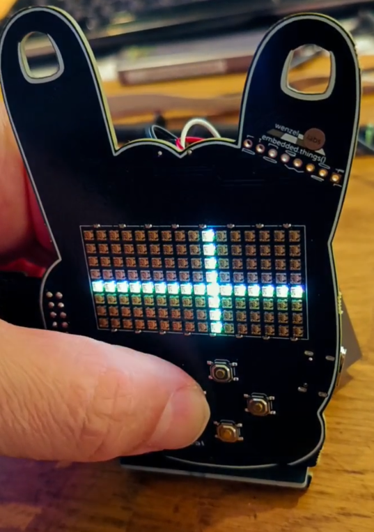

# bare_metal

**bare metal** is an FPGA development board - the ideal platform to get started with FPGAs and HDL of one or another sort. all open source.



- five user buttons: OK, left, right, up, down
- large 16x8 SPI-addressable RGB LEDs display
- extensible through a PMOD interface
- extensive power management, monitoring and battery protection in HW
- allows for CPU-less designs or soft-core CPUs
- get into FPGAs with the **yosys** and **nextpnr** all open source toolchains
- program in python/amarant, verilog or spade
- comes with LiPo battery
- comes with a stand
- three bright white LEDs as simple debug or flashlight
- usable as name tag, comes with a lace
- comes with a bootloader as 1st of four bitstreams
- can host up to 3 user bitstreams
- 16MBytes flash in total (1 bitstream takes < 128kBytes)
- 8MBytes RAM in total
- transputer research platform, as 3 user bitstreams can "boot" each other, see `bootloader` below
- hacky but feasible: more that 3 user bitstreams (hundreds)

## tech bits

### schematic

will be published once it's stable. just contact me in case you're nosy.

### memory

- 16MBytes SPI flash (W25Q128JVSIQ) this is where the FPGA boots from and user storage such as text, fonts, images, sounds, video, etc.
- 8MBytes SPI PSRAM (LY68L6400) far all of your extensive memory needs

here's a memory map of the SPI flash:

```
# 0x000_0000 - 0x000_009f =160b, multiboot header, slot table
# 0x000_00a0 - 0x001_efff ~124kB, slot 0, bare_metal_bootloader
# 0x001_f000 - 0x001_ffff =4kB, bootmetadata
# 0x002_0000 - 0x003_ffff =128kB, slot 1, user bitstream, hackerstacker_demo by default
# 0x004_0000 - 0x005_ffff =128kB, slot 2, another bitstream, transputers anyone?
# 0x006_0000 - 0x007_ffff ~128kB, slot 3, yab, hooray for transputers!
# 0x008_0000 - 0x100_0000 ~15.5MB, user data, images, fonts, text, sounds, videos etc
```
```
# in hackerstacker_demo, we reserve the first 512 KB for bootloader and bitstreams,
# and use the rest for user data:
# 0x008_0000 - 0x008_ffff = 64 kB, font data
# 0x009_0000 - 0x009_ffff = 64 kB, game data
# 0x00a_0000 - 0x00a_ffff = 64 kB, nick names
# 0x00b_0000 - 0x0ff_ffff = ~15.3MB images, video
```

### bootloader

the bootloader is forked from https://github.com/tinyfpga/TinyFPGA-Bootloader which looks unmaintained nowadays. we forked, and implement our bootloader and the `tinyprog` flashing tool at https://codeberg.org/wenzellabs/bare_metal_bootloader

```

                   [-----------][----------][----------]
                   [ user bit- ][ user bit-][ user bit-]
                   [ stream 1  ][ stream 2 ][ stream 3 ]
                   [           ][          ][          ]
                   [===========][==========][==========]
                   [-----------------------------------]
                   [    USB-bootloader bitstream 0     ]
                   [===================================]
               [-------------------------------------------]
               [ iCE40-up5k-sg48 FPGA, 5k LCs, DSP fn()s   ]
               [===========================================]
[-----]    [----------------------------------------------------]    [---------------]
[ USB ]----[ bare_metal, buttons, batt., LEDs, RGB-display, PMOD]----[PMOD extensions]
[=====]    [====================================================]    [===============]

```

### power

#### battery

a (clone of the) SONY (bah!) PS5 controller battery SNYHR37. any mAh printings are a lie.
the little plasic box is a nice feature to protect the pouch cell from stabbing you and vice versa.

#### USB-C

there's a current limit of 1.5A in place. no PD, just 5V.

#### battery protection

we turn the screen off at around 3V battery voltage to notify the user that she needs a power up.
at 2.5V a hard battery protection kicks in, and everything is switched off, until charging via USB-C again.

there's also a overvoltage protection and thermal monitoring in place.

#### the ring of power

bare_metal wears a little ring at it's pinky, the `ring of power`.
here all various important voltages are accessible:

- 1 GND
- 2 VBUS
- 3 VBAT_MINUS
- 4 BAT_TEMP_SENSE
- 5 VBAT
- 5 3V3
- 6 VCHG
- 7 VMAIN

## the FPGA

it's a **Lattice iCE40 UP5K** in a **SG48** package

- fully supported by yosys and nextpnr
- 5000+ LUTs
- 8 DSP blocks (MULT16 with ACC32)
- 1024kBits SPRAM in 4 blocks
- 120kBits EBR memory in 30 blocks
- 2 hard I2C blocks
- 2 hard SPI blocks

